# Golang Calendar CLI

This application is a CLI that was written in Golang using Cobra, it communicates with your Google calendar, allowing you to create, display and delete events via the command line.

## Technologies

- [x] [Golang](https://go.dev)
- [x] [Cobra](https://github.com/spf13/cobra)
- [x] [Google Calendar API](https://developers.google.com/calendar/api/guides/overview)

<details>
<summary>GCP Setup</summary>

Follow the steps below to configure your application on GCP, as we need to create a project in it and activate the Calendar API.

Go to Google Cloud Platform here: [link](https://console.cloud.google.com)

### Step 1

Create a new project

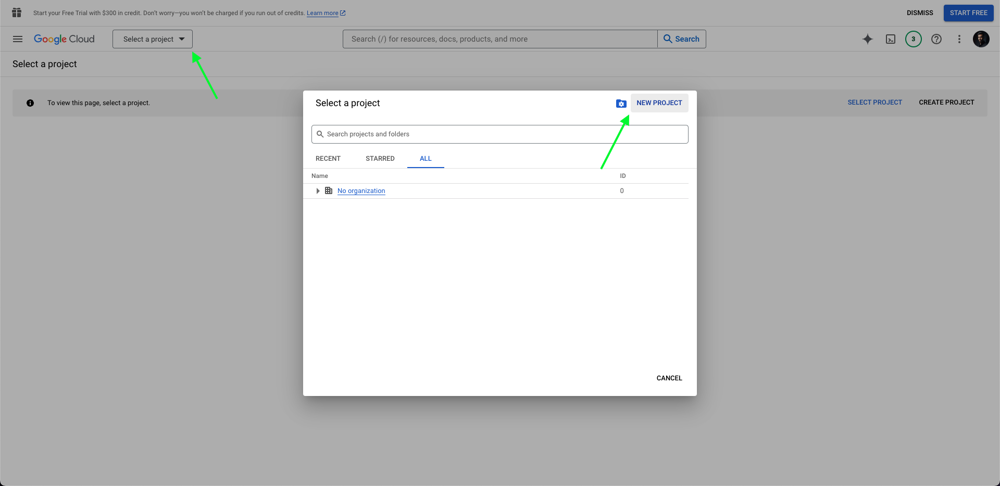

### Step 2

Define project name

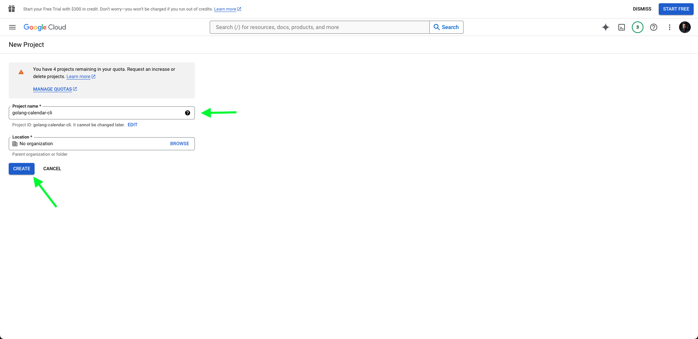

### Step 3

Access Google Calendar API page

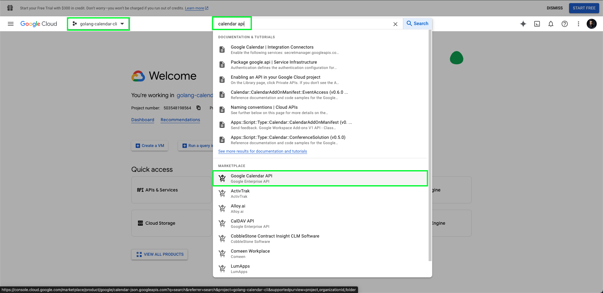

### Step 4

Enable Google Calendar API

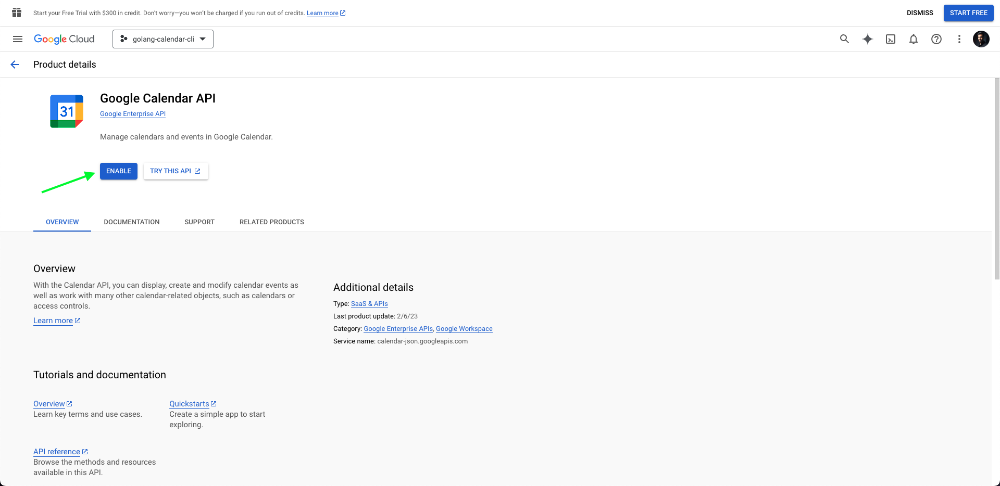

### Step 5

Access credentials page

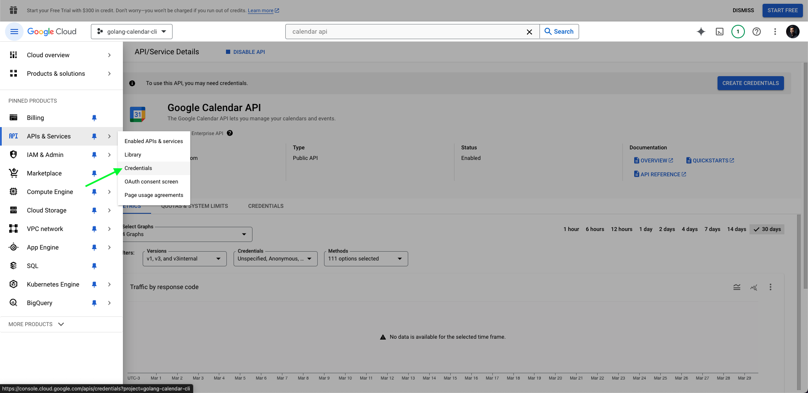

### Step 6

Access service account option

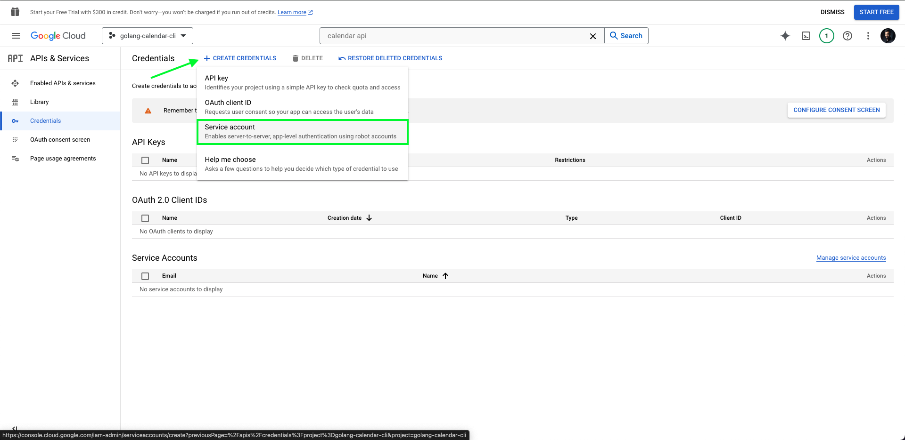

### Step 7

Service account details

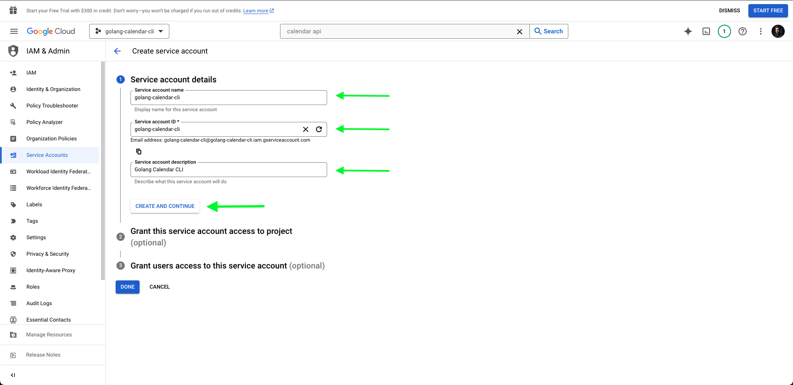

### Step 8

Grant this service account access to project

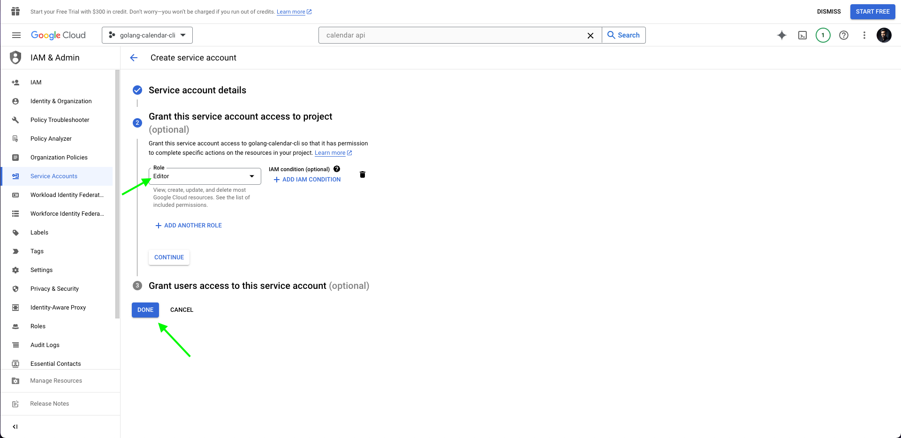

### Step 9

Click on your created service account

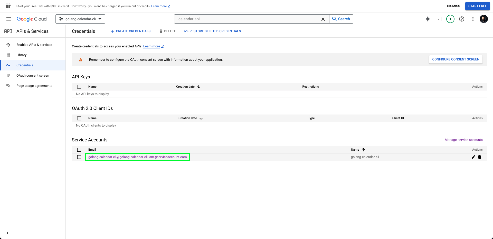

### Step 10

Create new key

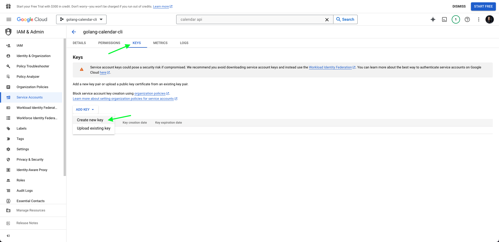

### Step 11

Download the JSON file

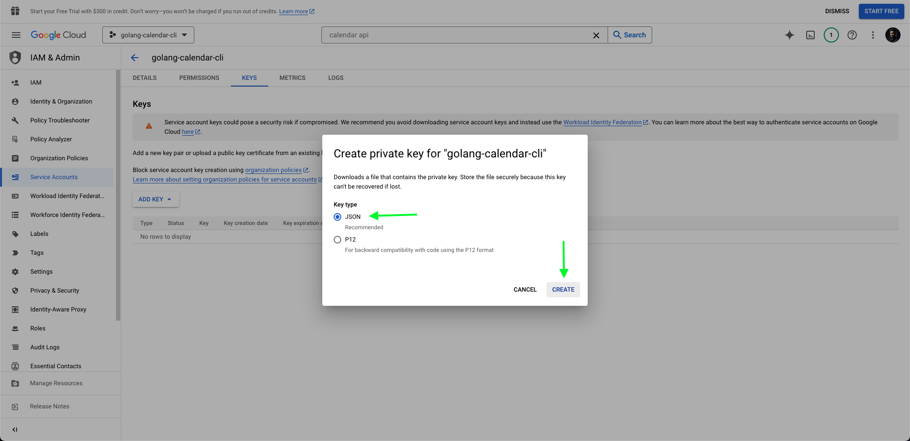

> Save it in the project root with the name `credentials.json`

</details>

<details>
<summary>Google Calendar Setup</summary>

Follow the steps below to configure your application on Google Calendar.

Go to Google Calendar here: [link](https://calendar.google.com)

### Step 1

Access settings page

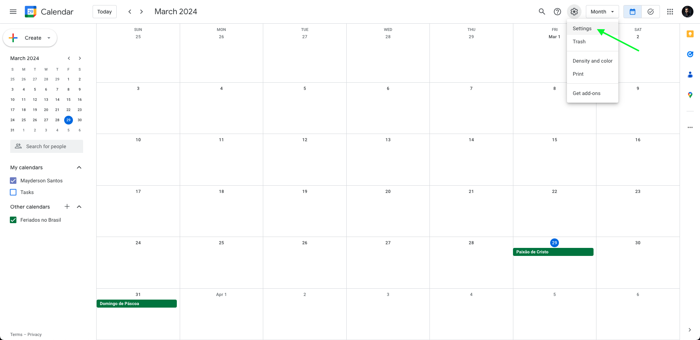

### Step 2

Create a new calendar

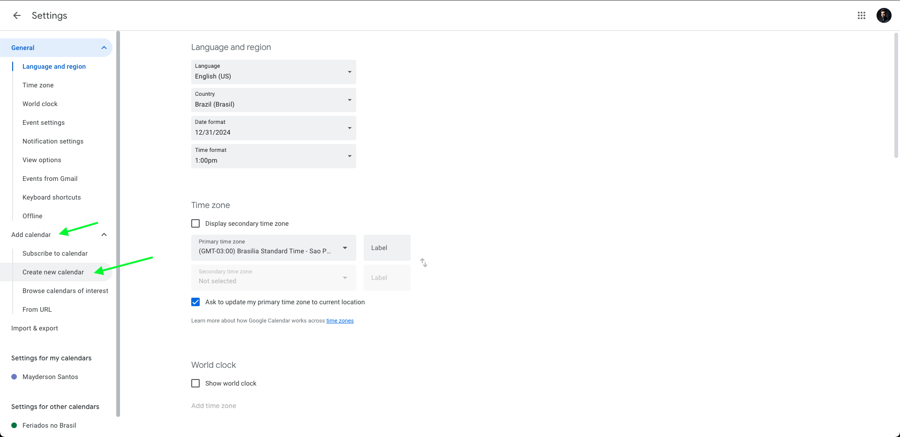
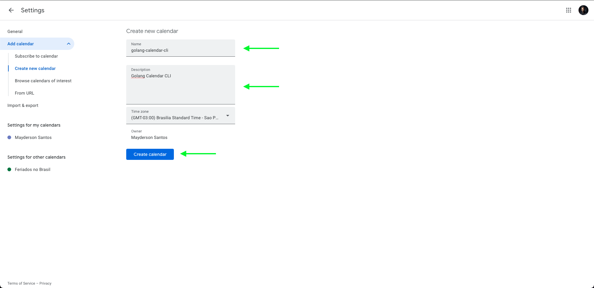

### Step 3

Share with specific people or groups

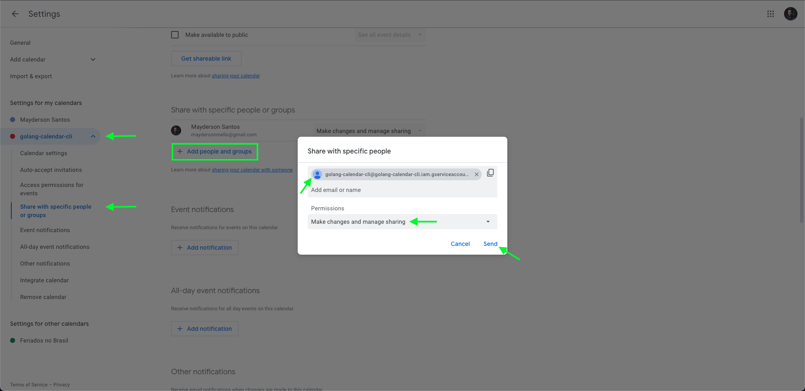

> Copy the `client_email` from the credentials file previously downloaded from GCP and add this email in this step.

### Step 4

Copy calendar ID

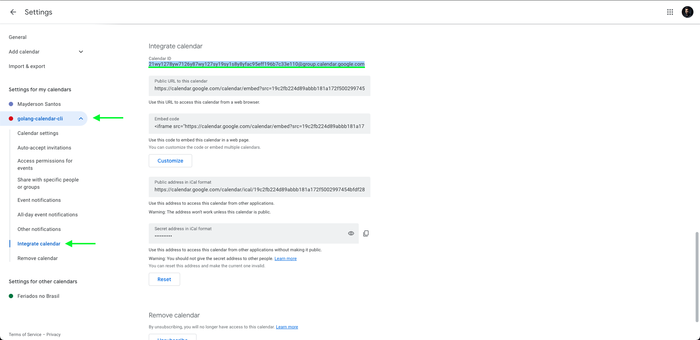

> You need to copy the calendar id, as it will be used in the application execution step below.

</details>

<details>
<summary>Execute application</summary>

## Setup app

Make sure the `credentials.json` file is in the root of the project, as instructed in the GCP setup step.

Change the calendar name in [internal/calendar/calendar.go](./internal/calendar/calendar.go) line 17:

```go
const AGENDA = "YOUR CALENDAR NAME"
```

Install dependencies:

```sh
$ go mod download
```

## Execute app

Build application:

```sh
$ go build
```

Create integration:

```sh
$ ./golang-calendar-cli agenda ID
```

> Is the ID copied in the Google Calendar Setup step.

> This action is only necessary once.

### Commands

Create a new event

```sh
$ ./golang-calendar-cli events insert --title "New Event” --description "New Event Description” --location "My home” --dateTimeStart "2024-03-29T09:00:00-03:00" --dateTimeEnd "2024-03-29T17:00:00-03:00"
```

> For more details run: `./golang-calendar-cli events insert -h`

Show events by day

```sh
$ ./golang-calendar-cli events day
```

Show events by week

```sh
$ ./golang-calendar-cli events week
```

Delete event by ID

```sh
$ ./golang-calendar-cli events delete ID
```

> You can get the event ID by viewing events by day or week

</details>
